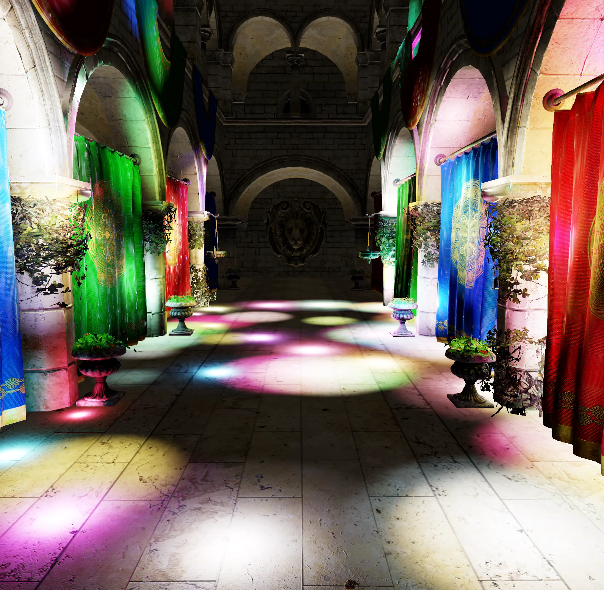

# Project Vapor

 
 

A modern 3D renderer built from scratch with C++ and Metal/Vulkan. 

Project Vapor is my deep dive into game engine architecture and current-gen rendering techniques, specifically GPU-driven rendering and hybrid rendering. It's a solo journey where I design and to implement various aspects of a modern 3D game engine. 

Aside from personal learning, I'd also like to share knowledge with those learning to make engines! 

<!--
### Blog
[Arcane Realms](https://painfulexistence.substack.com/) -->

### Main Features
#### Rendering
- Made with Metal-cpp and Vulkan
- Physically-based rendering with Disney BRDF
- GLTF scene loading
- Tiled Forward rendering
- Raytraced hard shadow (Metal only)

### Screenshots
#### Forward shading with tiled light culling

#### Raytraced hard shadow

