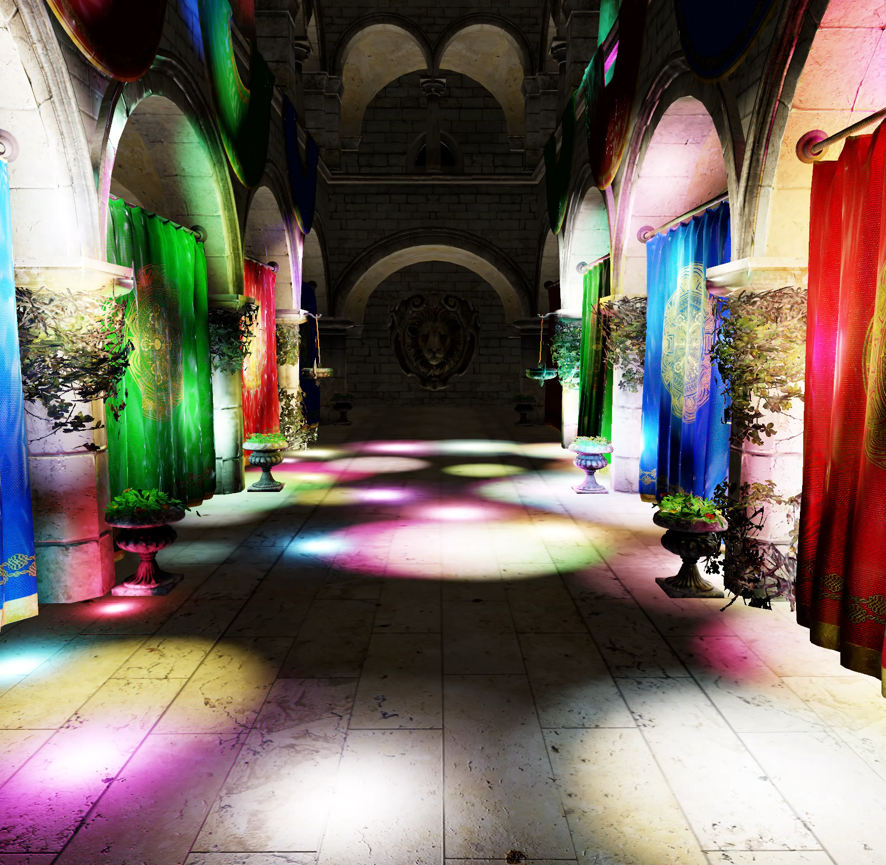

# Project Vapor


[](https://twitter.com/intent/follow?screen_name=DevLucidum)
[](https://painfulexistence.substack.com/)
<br />
<br />

<p>A modern 3D renderer built from scratch with C++ and Metal/Vulkan. </p>
<p>Project Vapor is my deep dive into game engine architecture and current-gen rendering techniques, specifically GPU-driven rendering and hybrid rendering. It's a solo journey where I design and to implement various aspects of a modern 3D game engine. </p>
<p>Aside from personal learning, I'd also like to share knowledge with those learning to make engines! </p>

<!--
### Blog
[Arcane Realms](https://painfulexistence.substack.com/) -->

### Main Features
#### Rendering
- Made with Metal-cpp and Vulkan
- Physically-based rendering with Disney BRDF
- GLTF scene loading
- Tiled Forward rendering
- Raytraced hard shadow (Metal only)

### Getting Started

**Prerequisites**
- macOS with Xcode Command Line Tools
- CMake 3.24+
- Ninja (`brew install ninja`)
- ccache (`brew install ccache`)

**Configure**
```bash
cmake --preset dev
```

**Build & Run (Metal)**
```bash
cmake --build --preset dev --target main -j4
./build/Vaporware/Debug/main
```

**Build & Run (Vulkan)**
```bash
cmake --build --preset dev --target main -j4
./build/Vaporware/Debug/main --vulkan
```

### Testing

76 characterization tests across 5 binaries. These tests lock in the existing behavior of core engine systems — if a refactor silently breaks something, a test will fail.

```bash
cmake --build --preset dev --target test_action_system test_scene_transform test_camera test_physics test_resource_manager -j4
ctest --preset dev
```

Expected output: `100% tests passed, 0 tests failed out of 76`

| Binary | # | What it covers |
|--------|---|----------------|
| `test_action_system` | 37 | `ActionManager` start/stop/tag, `Timer` progress/reset, easing functions, `TimelineAction` sequencing, `ParallelAction`, instant-action chaining |
| `test_scene_transform` | 16 | Scene graph dirty propagation, world transform composition across 3-level hierarchies, `setLocalPosition/Scale`, `findNodeInHierarchy` |
| `test_camera` | 21 | Perspective/ortho projection matrices, `getViewMatrix` caching, frustum plane normals, `isVisible` for spheres and AABBs |
| `test_physics` | 1 | Jolt Physics body lifecycle: create → add → remove → destroy, no crash or assert |
| `test_resource_manager` | 2 | Async scene/image loading, cache deduplication (same path returns same handle) |

CI runs on every push via GitHub Actions (macOS 15, Ninja, ccache).

### Screenshots
#### Forward shading with tiled light culling

#### Raytraced hard shadow

